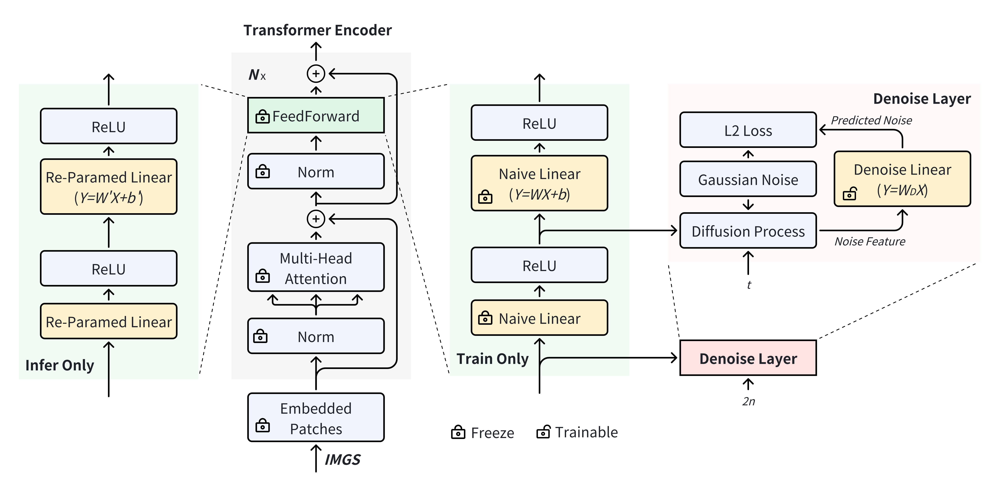
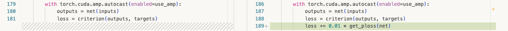
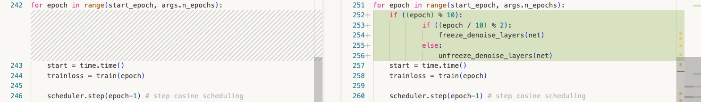

# *DenoiseRep*: Denoising Model for Representation Learning

_DenoiseRep_ is a computation-free, label-optional and model-irrelevant algorithm to incrementally improve representation learning. 

##  [Paper](https://openreview.net/pdf?id=OycU0bAus6) | [Slides](https://neurips.cc/media/neurips-2024/Slides/95335.pdf)  | [Poster](https://neurips.cc/media/PosterPDFs/NeurIPS%202024/95335.png?t=1731687775.3890939)

*DenoiseRep*: Denoising Model for Representation Learning.<br>
Zhengrui Xu&, Guan'an Wang&^, Xiaowen Huang*, Jitao Sang.<br>
NeurIPS 2024 (Oral)

&Equal Contribution \
^Project Lead \
*Contact Author

## Updates

- 2024.12.27: code released. thanks to Zhengrui Xu's contribution, who is the code developer.
- 2024.10.28: init project, code coming soon.

## TODO

- [x] release DenoiseRep basic code.
- [x] implement `DenoiseLinear`.
- [ ] implement `DenoiseConv2d`.
- [x] a tutorial of cifar10.
- [x] implement Person-ReID experiments.
- [ ] implement Classification (ImageNet) experiments.
- [ ] implement Detection / Segmentation experiments.

## Pipeline



## Experimental Results

| Tasks          | Model         | Backbone  | Dataset     | Metric | Baseline | +_DenoiseRep_ |
|:--------------:|:-------------:|:---------:|:-----------:|:------:|:--------:|:-------------:|
| Classification | ViT         | ViT patch=4  | Cifar-10 | acc@1  | 85.6%   | 86.2% [(model)](https://drive.google.com/file/d/1exsexxqnoG7hwifh4GkFtO6XO_HEq3U8/view?usp=sharing)       |
| Person-ReID    | TransReID-SSL | ViT-S     | MSMT17      | mAP    | 66.3%   | 67.3% [(model)](https://drive.google.com/file/d/1ZSSylQTMg9zxHukVDBhZevIprybByuMl/view?usp=sharing)        |


## Installation RenoiseRep Lib

```bash
cd denoiserep_op
bash make.sh
pip show denoiserep
```

## 3 Steps to apply DenoiseRep to your model

load your model trained with the original pipeline, and convert to denoiserep.


train your model by adding ploss.


a training trick to obtain better performance.


please see more details by comparing [train_cifar10.py](Classification/cifar-10/vision-transformers-cifar10/train_cifar10.py) and [train_cifar10_denoise.py](Classification/cifar-10/vision-transformers-cifar10/train_cifar10_denoise.py)

## Citing DenoiseRep

If you find denoise-rep useful in your research, please consider citing:

```
@inproceedings{xu2024denoiserep,
    title={DenoiseRep: Denoising Model for Representation Learning},
    author={zhengrui Xu and Guan'an Wang and Xiaowen Huang and Jitao Sang},
    booktitle={The Thirty-eighth Annual Conference on Neural Information Processing Systems},
    year={2024},
    url={https://openreview.net/forum?id=OycU0bAus6}
}
```

## Acknowledgement

Our implementation is mainly based on the following codebases. We gratefully thank the authors for their wonderful works.

[TransReID-SSL](https://github.com/damo-cv/TransReID-SSL), [Swin-Transformer](https://github.com/microsoft/Swin-Transformer), [mmdetection](https://github.com/open-mmlab/mmdetection), [mmsegmentation](https://github.com/open-mmlab/mmsegmentation).
